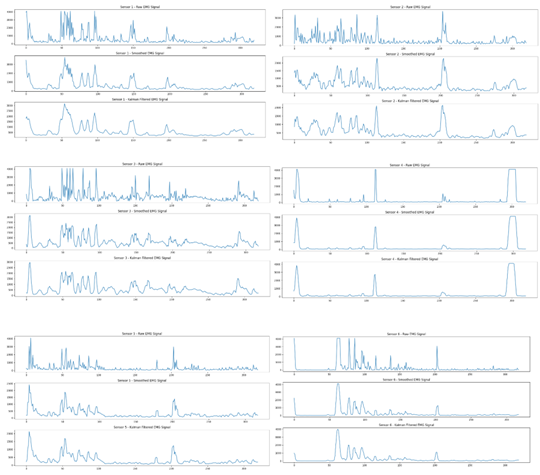

# Wearable Kyphosis Management System

A wearable embedded system designed to monitor spinal posture using EMG sensors and IMU-based angle tracking, providing real-time vibration feedback for posture correction.

---

## 🧠 Overview

This project aims to address poor posture and kyphosis-related issues by combining:

- Muscle activity monitoring (EMG)
- Spinal angle tracking (IMU sensors)
- Real-time feedback using vibration motors

The system is integrated into a wearable back brace for continuous posture monitoring.

---

## 🚀 Key Features

- Multi-point EMG sensing across the back
- Dual MPU6050 IMU sensors for orientation tracking
- Real-time posture detection
- Vibration-based feedback system
- Custom PCB for compact integration
- Signal processing pipeline for EMG analysis

---

## 🧩 System Architecture

```text
EMG Sensors ─┐
             ├──> ESP32 ───> Signal Processing ───> Posture Detection ───> Vibration Feedback
IMU Sensors ─┘
```
---

## 🖼️ Hardware Design

### PCB Design


### Fabricated PCB


---

## 🦺 Wearable Prototype


---

## 🧬 EMG Sensor Placement


---

## 📊 Signal Processing Output



---

## 📁 Repository Structure

```text
wearable-kyphosis-management-system/
├── firmware/              # Embedded code (ESP32 / Arduino)
├── hardware/              # PCB + hardware design details
├── signal-processing/     # EMG filtering and analysis (Python)
├── docs/                  # Project report and documentation
├── images/                # Project images
└── README.md
```
---

## ⚙️ Technologies Used

- ESP32 (Microcontroller)
- MPU6050 (IMU)
- EMG Sensors
- Python (Signal Processing)
- PlatformIO / Arduino
- KiCad / PCB Design Tools

---

## 📌 How It Works

1. EMG sensors capture muscle activity across the back  
2. IMU sensors measure spinal angle and motion  
3. ESP32 reads and streams sensor data  
4. Python processes and filters EMG signals  
5. System detects poor posture conditions  
6. Vibration motors alert the user  

---

## 📄 Documentation

Full project report available in:
docs/kyphosis_project_report.pdf


---

## 🎯 Applications

- Posture correction systems  
- Rehabilitation monitoring  
- Wearable health devices  
- Ergonomic assessment  


## 👨‍💻 Author

**Rishoban Kandeepan**
