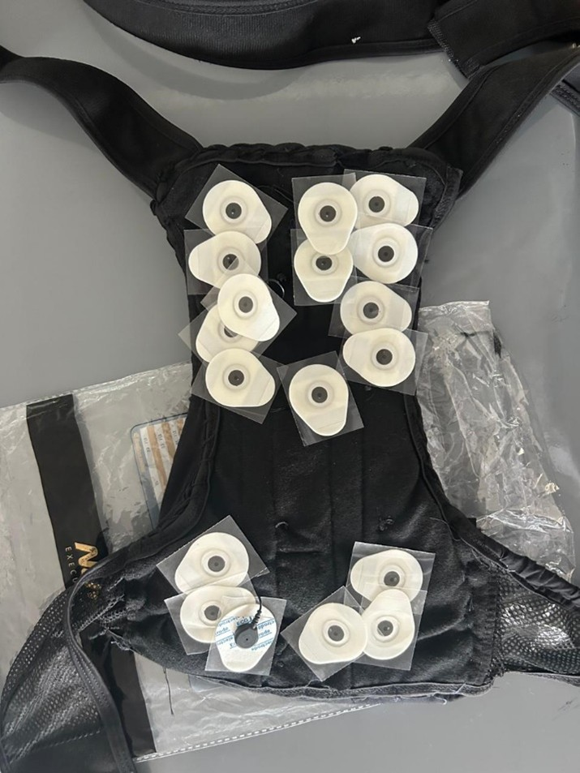
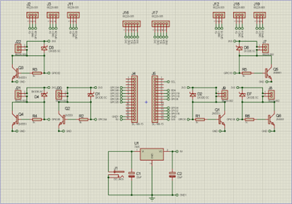
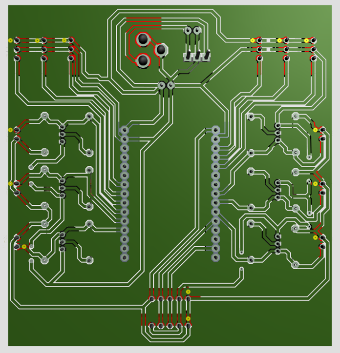
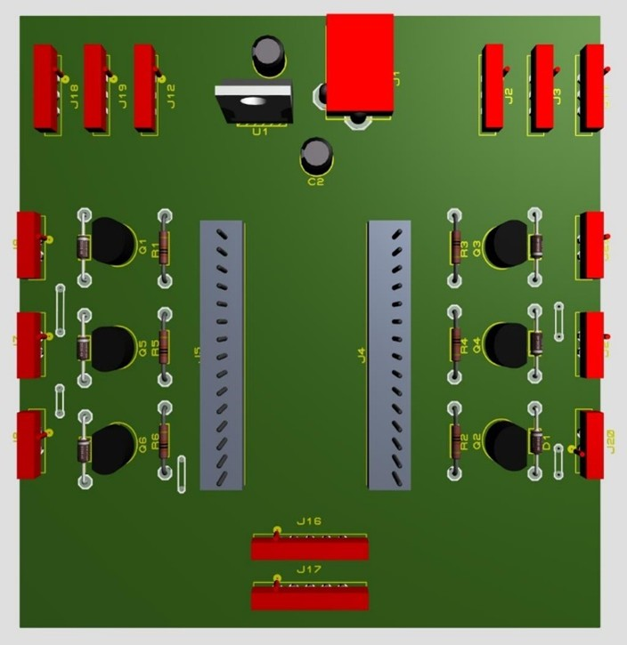
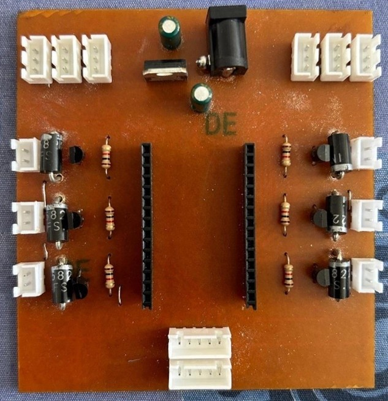
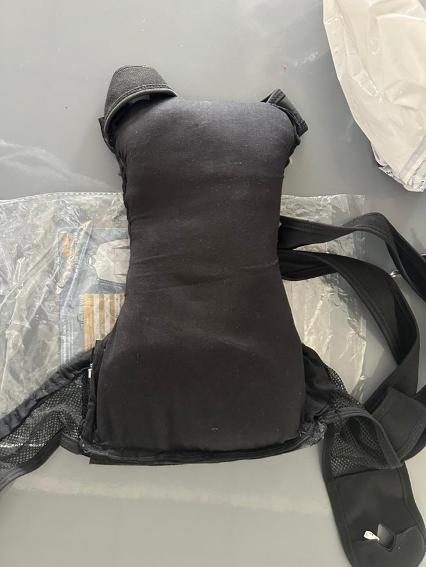

# Hardware

This folder documents the hardware design of the Wearable Kyphosis Management System.

---

## 🧠 System Overview

The hardware system is designed to monitor spinal posture using a combination of **muscle activity (EMG)** and **body orientation (IMU sensors)**, and provide **real-time feedback** through vibration motors.

The system is built as a wearable back brace with integrated sensing and actuation.

---

## 🔩 Hardware Architecture

The system consists of:

- **EMG Sensor Network** — captures muscle activation across the back
- **IMU Sensors (MPU6050)** — measures spinal orientation and motion
- **ESP32 Microcontroller** — handles data acquisition and communication
- **Custom PCB** — integrates sensors, connectors, and power distribution
- **Vibration Motors** — provide posture correction feedback
- **Power System** — battery + regulation circuitry

---

## 📡 EMG Sensor Configuration

- Multiple EMG sensors are placed across the upper, middle, and lower back
- Each sensor captures localized muscle activity
- Signals are routed to analog inputs of the ESP32
- Enables detection of muscle imbalance and strain patterns

### EMG Sensor Placement

---

## 🧭 Motion Sensing (IMU)

- MPU6050 sensors used for:
  - Accelerometer (tilt detection)
  - Gyroscope (angular motion)
- Used to estimate spinal curvature and posture deviation
- Dual sensor setup allows better spatial tracking

---

## ⚡ Custom PCB Design

A custom PCB was developed to:

- Interface EMG sensors and IMU modules
- Provide stable power distribution
- Connect vibration motors
- Reduce wiring complexity for wearable use

### PCB Schematic

### PCB Layout

### 3D PCB Model

### Fabricated PCB

---

## 🔋 Power System

- Powered using rechargeable battery pack
- Includes voltage regulation for stable operation
- Designed for portable, wearable usage

---

## 🔔 Feedback System

- Vibration motors placed on the back brace
- Activated when poor posture is detected
- Provides immediate tactile feedback to the user

---

## 🦺 Wearable Integration

All components are integrated into a wearable back brace:

- Sensors positioned along the spine
- PCB mounted centrally
- Wiring embedded within the brace
- Designed for comfort and mobility

### Wearable Prototype

---

## 📝 Notes

- Hardware design focused on reliability and wearability
- Sensor placement and thresholds were refined experimentally
- Designed as a functional prototype for real-world testing
